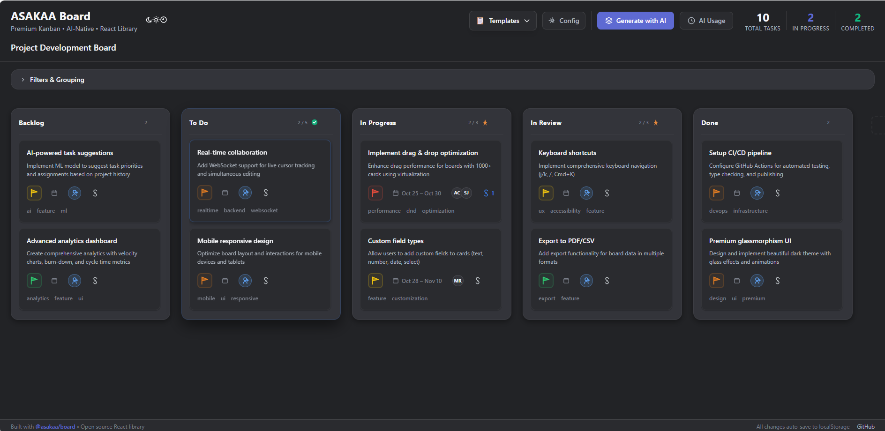
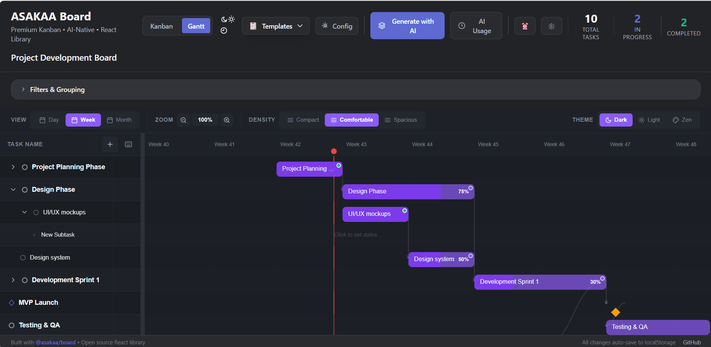
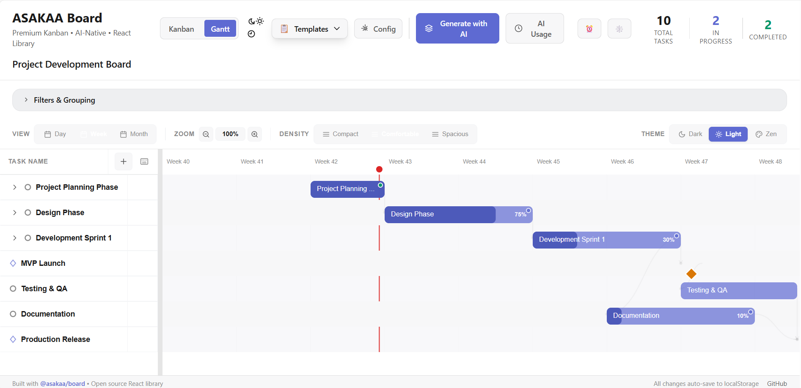
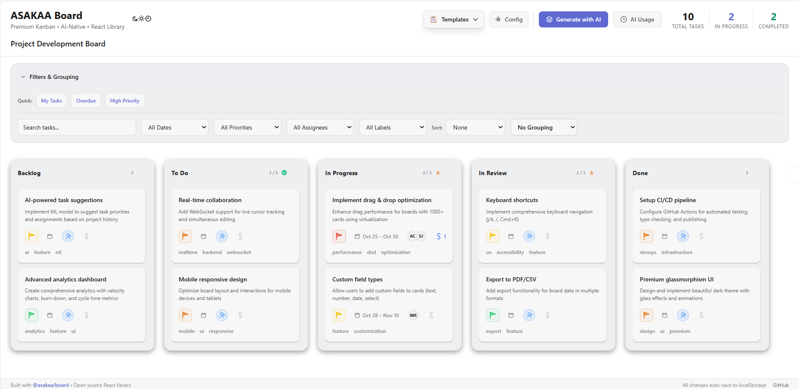
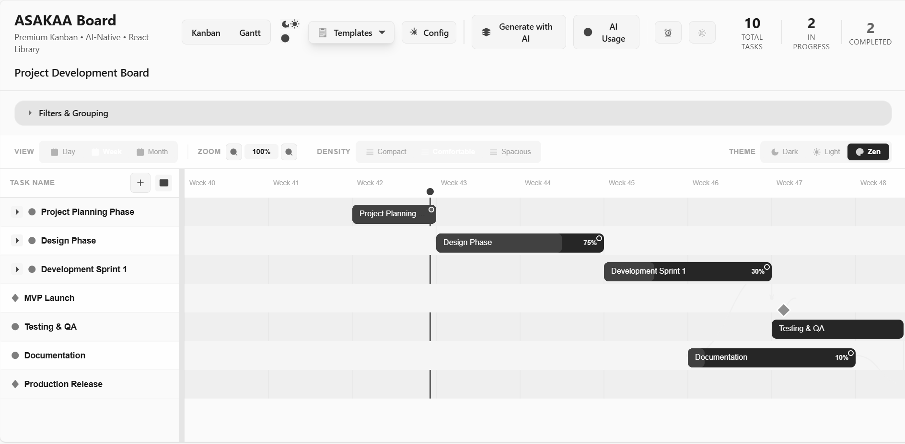
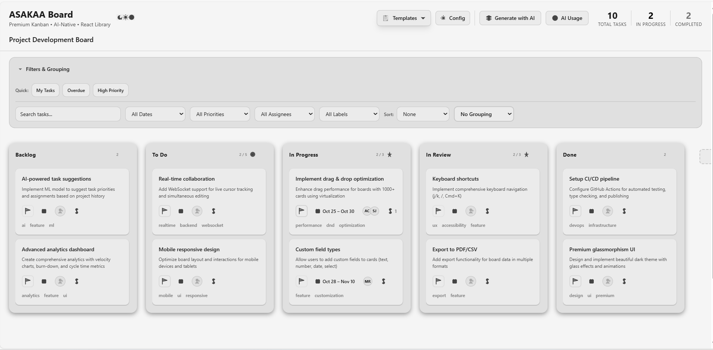

<div align="center">


# LibXAI Suite

### **Professional React Component Library for Modern Teams**

**Modular** • **TypeScript-First** • **Production-Ready** • **Zero Configuration**

[](https://www.npmjs.com/package/@libxai/board)
[](./LICENSE)
[](https://www.typescriptlang.org/)
[](https://reactjs.org/)
[](https://bundlephobia.com/package/@libxai/board)

[🚀 Get Started](#quick-start) • [📖 Documentation](https://libxai.com/docs) • [🎮 Live Demo](https://demo.libxai.com)

---

</div>

## 📦 Components

### ✅ [@libxai/board](./packages/board) - Available Now

**Gantt Chart + Kanban Board** - The only React library with both views in one component.

```bash
npm install @libxai/board
```

[📖 Board Documentation](#asakaa-board) • [🎮 Demo](https://demo.libxai.com/board)

---

### 🚧 Coming Soon

- **@libxai/calendar** (Q1 2026) - Smart scheduling component
- **@libxai/list** (Q2 2026) - Intelligent task lists
- **@libxai/table** (Q3 2026) - Advanced data tables

---

# 📊 @libxai/board

## Component Overview

## 🎯 Why LibXAI Board?

**Stop patching together 5 different libraries.** Get Gantt Chart + Kanban Board in one production-ready package.

```bash
npm install @libxai/board
# That's it. You're done. 🎉
```

### ⚡ What Makes It Different?

<table>
<tr>
<td width="33%" align="center">

### 🎨 **2-in-1 Views**
**Kanban + Gantt** in the same component. Switch views instantly. Same data, different perspectives.

</td>
<td width="33%" align="center">

### 🧠 **Smart by Default**
Circular dependency detection, date validation, undo/redo (50 levels). **Your users won't break things.**

</td>
<td width="33%" align="center">

### 🎯 **5-Minute Setup**
No configuration hell. Import, render, done. Comes with themes, keyboard shortcuts, and accessibility **out of the box**.

</td>
</tr>
</table>

---

## 📸 See It In Action

### **Gantt Chart View** - Professional Project Planning

> **NEW in v0.8.1:** Critical Path Analysis, Auto-Scheduling, Split Tasks - **Better than DHTMLX, 100% FREE**

<!-- REPLACE THIS WITH YOUR SCREENSHOT -->


<details>
<summary><strong>✨ Gantt Features (Click to expand)</strong></summary>

<br>

**🔥 Killer Features (v0.8.0) - Better than DHTMLX:**
- 🏆 **Critical Path Analysis** - Automatic CPM calculation (FREE - DHTMLX charges $1,299/dev!)
- 🏆 **Auto-Scheduling with Cascade** - Move a task, all dependents reschedule automatically (FREE!)
- 🏆 **Split Task with Gaps** - Pause work and resume later, Bryntum-style (FREE!)

**🎯 Core Capabilities:**
- ✅ **Drag & Drop Scheduling** - Move and resize task bars with pixel-perfect precision
- ✅ **Dependency Management** - Visual arrows showing task relationships (4 types: SS, FF, SF, FS)
- ✅ **Circular Dependency Detection** - Prevents invalid workflows with DFS algorithm
- ✅ **Milestone Markers** - Diamonds (not bars) for key deliverables
- ✅ **Progress Tracking** - Inline progress bars with percentages
- ✅ **Today Indicator** - Red vertical line showing current date
- ✅ **Hierarchical Tasks** - Unlimited nested subtasks with visual indentation
- ✅ **Context Menu** - Right-click for quick actions (split, indent, delete, etc.)

**🧠 Intelligent Features:**
- ✅ **Date Validation** - Can't create tasks shorter than 1 day or with start > end
- ✅ **Undo/Redo System** - 50 levels of history with Ctrl+Z/Ctrl+Y
- ✅ **Auto-Scroll Timeline** - Horizontal scroll for extended project timelines
- ✅ **Smart Icons** - Diamonds for milestones, circles for tasks, dots for subtasks

**⚙️ Views & Controls:**
- ✅ **3 Time Scales** - Day, Week (default), Month views
- ✅ **Column Manager** - Show/hide: Status, Assignees, Progress, Dates
- ✅ **3 Themes** - Dark, Light, Neutral with instant switching
- ✅ **Keyboard Shortcuts** - Tab (indent), Shift+Tab (outdent), F2 (rename), Delete

**📊 Professional Features:**
- ✅ **Export to PDF/Excel/PNG/CSV** - Built-in export to all formats
- ✅ **Resizable Panels** - Adjust task list / timeline ratio
- ✅ **6 Zoom Levels** - Hour, Day, Week, Month, Quarter, Year views

</details>

---

### **Kanban Board View** - Agile Workflow Management

<!-- REPLACE THIS WITH YOUR SCREENSHOT -->


<details>
<summary><strong>✨ Kanban Features (Click to expand)</strong></summary>

<br>

**🎯 Core Capabilities:**
- ✅ **Smooth Drag & Drop** - 60fps animations powered by @dnd-kit
- ✅ **Advanced Filtering** - Search, filter by assignee, labels, priority, dates
- ✅ **Virtual Scrolling** - Handle 10,000+ cards without lag
- ✅ **Keyboard Shortcuts** - Cmd+K command palette, arrow navigation
- ✅ **Bulk Operations** - Multi-select with Shift/Ctrl
- ✅ **Export/Import** - JSON, CSV, PDF exports built-in

**🎨 Themes:**
- ✅ **Dark Theme** - Speed, focus, and developer productivity
- ✅ **Light Theme** - WCAG AAA compliant (7:1 contrast)
- ✅ **Neutral Theme** - Minimalist grayscale for distraction-free work

</details>

---

## 🚀 Quick Start

### Installation

```bash
npm install @libxai/board
# or
yarn add @libxai/board
# or
pnpm add @libxai/board
```

### Basic Usage - Gantt Chart

```tsx
import { GanttBoard } from '@libxai/board'
import '@libxai/board/styles.css'

function App() {
  const tasks = [
    {
      id: '1',
      name: 'Project Setup',
      startDate: new Date('2025-01-01'),
      endDate: new Date('2025-01-05'),
      progress: 100,
      status: 'completed'
    },
    {
      id: '2',
      name: 'Development',
      startDate: new Date('2025-01-06'),
      endDate: new Date('2025-01-20'),
      progress: 60,
      status: 'in-progress',
      dependencies: ['1'] // Depends on task 1
    },
    {
      id: '3',
      name: 'Launch',
      startDate: new Date('2025-01-21'),
      endDate: new Date('2025-01-21'),
      isMilestone: true,
      dependencies: ['2']
    }
  ]

  return (
    <GanttBoard
      tasks={tasks}
      config={{
        theme: 'dark',
        timeScale: 'week',
        onTaskUpdate: (updatedTask) => {
          console.log('Task updated:', updatedTask)
        }
      }}
    />
  )
}
```

### Basic Usage - Kanban Board

```tsx
import { KanbanBoard } from '@libxai/board'
import '@libxai/board/styles.css'

function App() {
  return (
    <KanbanBoard
      columns={[
        { id: 'todo', title: 'To Do', cards: [] },
        { id: 'in-progress', title: 'In Progress', cards: [] },
        { id: 'done', title: 'Done', cards: [] }
      ]}
      onUpdate={(columns) => console.log('Board updated:', columns)}
    />
  )
}
```

**That's it!** 🎉 You now have a fully functional Gantt/Kanban board with:
- ✅ Drag & drop
- ✅ Theme switching
- ✅ Keyboard shortcuts
- ✅ Undo/redo
- ✅ And 50+ other features

---

## 💎 Feature Comparison

### vs. Other Solutions

| Feature | LibXAI Board | DHTMLX Gantt | Bryntum Gantt | Jira/Asana |
|---------|--------|--------------|---------------|------------|
| **Critical Path (CPM)** | ✅ FREE + Auto | 💰 $1,299/dev | 💰 Premium | ⚠️ Basic |
| **Auto-Scheduling Cascade** | ✅ FREE + Auto | ⚠️ Manual config | 💰 Premium | ⚠️ Limited |
| **Split Tasks with Gaps** | ✅ FREE | ❌ Not available | 💰 Premium | ❌ |
| **Gantt + Kanban** | ✅ Both views | ❌ Gantt only | ❌ Gantt only | 💰 Separate |
| **Dependency Types** | ✅ 4 types (SS,FF,SF,FS) | ✅ 4 types | ✅ 4 types | ⚠️ Basic |
| **Circular Dependency Detection** | ✅ DFS algorithm | ⚠️ Basic | ✅ | ⚠️ Basic |
| **Undo/Redo** | ✅ 50 levels | ⚠️ Limited | ✅ | ⚠️ Limited |
| **Export (PDF/Excel/PNG/CSV)** | ✅ All formats | 💰 PRO only | 💰 Premium | ⚠️ Limited |
| **TypeScript** | ✅ Full | ⚠️ Partial | ✅ | N/A |
| **Learning Curve** | **5 min** | 2-3 days | 2-3 days | Weeks |
| **Price** | **$0*** | **$1,299/dev** | **$1,499/dev** | $7-15/user/mo |
| **Self-hosted** | ✅ | ✅ | ✅ | ❌ |

*\*Without UI, themes, filtering, or features*
*\*\*Free for non-production use. Converts to Apache 2.0 in 2027. See [License](#license)*

---

## 📦 What's Included

### Gantt Chart Features (v0.8.0)

```tsx
import {
  GanttBoard,          // Main Gantt component
  useGanttKeyboard,    // Keyboard shortcuts hook
  useUndoRedo,         // Undo/redo system
  cardToGanttTask,     // Convert Kanban cards to Gantt tasks
  ganttTaskToCard      // Convert Gantt tasks to Kanban cards
} from '@libxai/board'
```

**Components:**
- `GanttBoard` - Complete Gantt chart with timeline
- `GanttToolbar` - Theme switcher, view controls
- `TaskGrid` - Hierarchical task list with inline editing
- `Timeline` - Visual timeline with drag-drop task bars
- `DependencyLine` - Curved arrows showing dependencies
- `Milestone` - Diamond markers for key deliverables
- `ColumnManager` - Toggle visibility of columns
- `ContextMenu` - Right-click actions

**Hooks:**
- `useUndoRedo<T>` - 50-level history management
- `useGanttUndoRedoKeys` - Ctrl+Z/Y keyboard shortcuts
- `useGanttKeyboard` - Arrow navigation, shortcuts
- `useGanttSelection` - Multi-select with Shift/Ctrl

**Utilities (ganttUtils):**
- `calculateCriticalPath()` - Automatic CPM with forward/backward pass (v0.8.1)
- `autoScheduleDependents()` - Cascade rescheduling of dependent tasks (v0.8.1)
- `splitTask()` - Split task with configurable gap duration (v0.8.1)
- `validateDependency()` - Circular dependency detection (DFS algorithm)
- Date validation (min 1 day, start < end)
- Hierarchy operations (indent, outdent, move, duplicate)
- Export utilities (PDF, Excel, PNG, CSV)
- Type adapters (Kanban ↔ Gantt conversion)

---

### Kanban Board Features

```tsx
import {
  KanbanBoard,         // Main Kanban component
  ThemeProvider,       // Theme context
  useTheme,            // Theme hook
  useBoard,            // Board state hook
  useFilters,          // Advanced filtering
  useSelection,        // Multi-select
  useUndo              // Undo/redo
} from '@libxai/board'
```

---

## 🎨 Themes

LibXAI Board comes with 3 professionally designed themes that work seamlessly across both Gantt and Kanban views:

### Dark Theme (Enhanced)
> Optimized for developer productivity and long coding sessions

**Gantt View:**



**Kanban View:**


---

### Light Theme (Standard)
> WCAG AAA compliant with 7:1 contrast ratios for accessibility

**Gantt View:**



**Kanban View:**



---

### Neutral Theme (Zen Mode)
> Pure monochrome for distraction-free focus

**Gantt View:**



**Kanban View:**



---

**Switching themes is instant:**
```tsx
import { ThemeSwitcher } from '@libxai/board'

function App() {
  return <ThemeSwitcher /> // One click, instant switch!
}
```

---

## 🎯 Real-World Examples

<details>
<summary><strong>Example 1: Software Development Sprint</strong></summary>

```tsx
const sprintTasks = [
  {
    id: 'epic-1',
    name: 'User Authentication Epic',
    startDate: new Date('2025-01-01'),
    endDate: new Date('2025-01-15'),
    progress: 75,
    subtasks: [
      {
        id: 'task-1',
        name: 'Design login UI',
        startDate: new Date('2025-01-01'),
        endDate: new Date('2025-01-03'),
        progress: 100,
        status: 'completed',
        assignees: [{ id: '1', name: 'Designer' }]
      },
      {
        id: 'task-2',
        name: 'Implement OAuth',
        startDate: new Date('2025-01-04'),
        endDate: new Date('2025-01-10'),
        progress: 80,
        status: 'in-progress',
        dependencies: ['task-1'],
        assignees: [{ id: '2', name: 'Backend Dev' }]
      },
      {
        id: 'task-3',
        name: 'Write tests',
        startDate: new Date('2025-01-11'),
        endDate: new Date('2025-01-15'),
        progress: 40,
        status: 'in-progress',
        dependencies: ['task-2']
      }
    ]
  },
  {
    id: 'milestone-1',
    name: 'Sprint 1 Complete',
    startDate: new Date('2025-01-15'),
    endDate: new Date('2025-01-15'),
    isMilestone: true,
    isCriticalPath: true,
    dependencies: ['epic-1']
  }
]

<GanttBoard tasks={sprintTasks} />
```

</details>

<details>
<summary><strong>Example 2: Marketing Campaign</strong></summary>

```tsx
const campaignTasks = [
  {
    id: '1',
    name: 'Research Phase',
    startDate: new Date('2025-02-01'),
    endDate: new Date('2025-02-07'),
    progress: 100
  },
  {
    id: '2',
    name: 'Content Creation',
    startDate: new Date('2025-02-08'),
    endDate: new Date('2025-02-20'),
    progress: 60,
    dependencies: ['1'],
    subtasks: [
      { id: '2a', name: 'Blog posts', progress: 80 },
      { id: '2b', name: 'Social media', progress: 40 }
    ]
  },
  {
    id: '3',
    name: 'Campaign Launch',
    startDate: new Date('2025-02-21'),
    endDate: new Date('2025-02-21'),
    isMilestone: true,
    isCriticalPath: true,
    dependencies: ['2']
  }
]

<GanttBoard
  tasks={campaignTasks}
  config={{ theme: 'light', timeScale: 'day' }}
/>
```

</details>

---

## 🔧 Advanced Configuration

### Gantt Configuration

```tsx
<GanttBoard
  tasks={tasks}
  config={{
    theme: 'dark' | 'light' | 'neutral',
    timeScale: 'day' | 'week' | 'month',
    rowDensity: 'compact' | 'comfortable' | 'spacious',
    showThemeSelector: true,
    availableUsers: [
      { id: '1', name: 'John Doe', initials: 'JD', color: '#3B82F6' }
    ],
    onTaskClick: (task) => console.log('Clicked:', task),
    onTaskUpdate: (task) => console.log('Updated:', task),
    onDependencyCreate: (fromId, toId) => console.log('Dependency:', fromId, '→', toId),
    onDependencyDelete: (taskId, depId) => console.log('Removed dependency')
  }}
/>
```

### Keyboard Shortcuts

**Gantt Chart:**
- `Tab` - Indent task (create subtask)
- `Shift+Tab` - Outdent task (promote to parent level)
- `F2` - Rename task
- `Delete` - Delete task
- `Ctrl+Z` / `Cmd+Z` - Undo
- `Ctrl+Y` / `Cmd+Shift+Z` - Redo
- `Ctrl+D` / `Cmd+D` - Duplicate task
- `Alt+Up` / `Alt+Down` - Move task up/down
- `Shift+Click` - Connect tasks (create dependency)
- `Click on timeline` - Create 1-day task bar

**Kanban Board:**
- `Cmd+K` / `Ctrl+K` - Open command palette
- `Arrow keys` - Navigate cards
- `Space` - Select/deselect card
- `Shift+Click` - Multi-select
- `Delete` - Delete selected cards

---

## 📊 Performance

**Built for scale:**
- ✅ Virtual scrolling handles **10,000+ tasks**
- ✅ **60fps** drag-and-drop animations
- ✅ Debounced search (300ms) for instant filtering
- ✅ Optimized re-renders with `React.memo`
- ✅ Tree-shakeable - only import what you need

**Bundle Size:**
- ESM: 328 KB (minified)
- Gzipped: ~85 KB
- CSS: 67 KB

---

## 🧪 TypeScript Support

**100% TypeScript with complete type definitions:**

```tsx
import type {
  Task,
  GanttConfig,
  TimeScale,
  Theme,
  Dependency,
  TaskStatus
} from '@libxai/board'

const task: Task = {
  id: '1',
  name: 'TypeScript Heaven',
  startDate: new Date(),
  endDate: new Date(),
  progress: 100,
  status: 'completed',
  isMilestone: false,
  dependencies: [],
  subtasks: []
}
```

---

## 🌐 Browser Support

- ✅ Chrome/Edge 90+
- ✅ Firefox 88+
- ✅ Safari 14+
- ✅ Modern mobile browsers

---

## 📚 Documentation

- [📖 Full API Reference](./packages/board/docs/)
- [🎯 Examples & Recipes](./packages/board/examples/)
- [📝 CHANGELOG](./packages/board/CHANGELOG.md)
- [🐛 Report Issues](https://github.com/libxai/libxai-suite/issues)

---

## 🗺️ Roadmap

### v0.9.0 (Planned - Q1 2026)
- [ ] Resource allocation view (resource leveling, workload balancing)
- [ ] Baseline comparison (planned vs actual)
- [ ] Real-time collaboration (WebSocket support)
- [ ] Custom field types

### v1.0.0 (Planned - Q2 2026)
- [ ] Export to MS Project / Jira format
- [ ] Mobile-optimized touch controls
- [ ] Calendar view
- [ ] Advanced filtering (saved filters, complex queries)

**Want a feature?** [Open an issue!](https://github.com/libxai/libxai-suite/issues/new)

---

## 🤝 Contributing

We welcome contributions! See [CONTRIBUTING.md](./CONTRIBUTING.md) for guidelines.

**Quick start:**
```bash
git clone https://github.com/libxai/libxai-suite.git
cd libxai-suite/packages/board
npm install
npm run dev
```

---

## 📄 License

**Business Source License 1.1**

- ✅ **Free for non-production use** (development, testing, evaluation)
- ✅ **Converts to Apache 2.0** on 2027-10-12 (fully open source)
- ✅ **Commercial use:** Contact for licensing

See [LICENSE](./LICENSE) for full details.

**TLDR:** Use it freely for side projects, learning, and evaluation. For production use in commercial products, please reach out.

---

## 🏆 Built With

- [React](https://reactjs.org/) - UI library
- [TypeScript](https://www.typescriptlang.org/) - Type safety
- [@dnd-kit](https://dndkit.com/) - Drag and drop
- [Framer Motion](https://www.framer.com/motion/) - Animations
- [Lucide React](https://lucide.dev/) - Icons
- [Jotai](https://jotai.org/) - State management

---

## 💖 Show Your Support

If LibXAI Suite saves you time:

- ⭐ Star this repository
- 🐦 Share it on Twitter
- 📝 Write a blog post
- 🎥 Create a tutorial
- 💬 Spread the word!

---

<div align="center">

**Part of the LibXAI ecosystem**

[Website](https://libxai.com) • [GitHub](https://github.com/libxai) • [NPM](https://npmjs.com/org/libxai)

[⬆ Back to Top](#libxai-suite)

</div>
